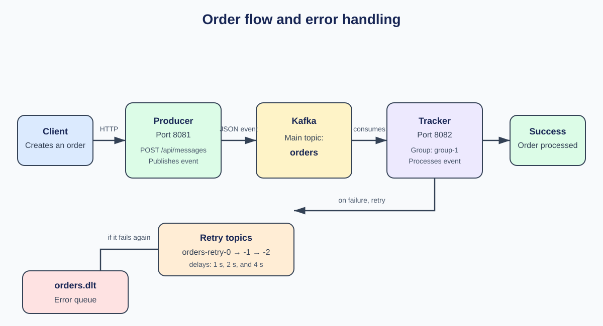
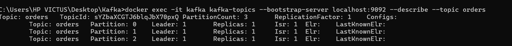
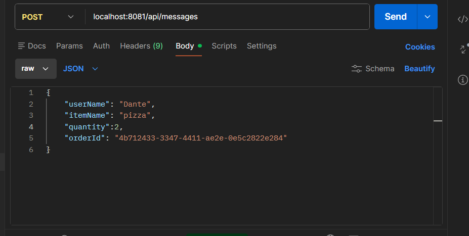
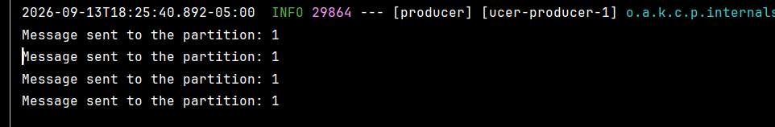
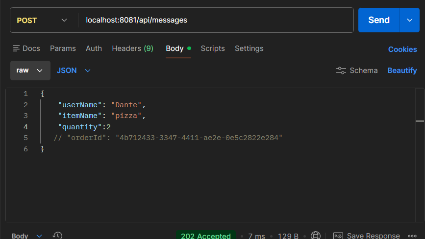
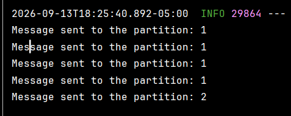
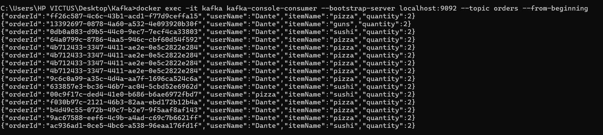
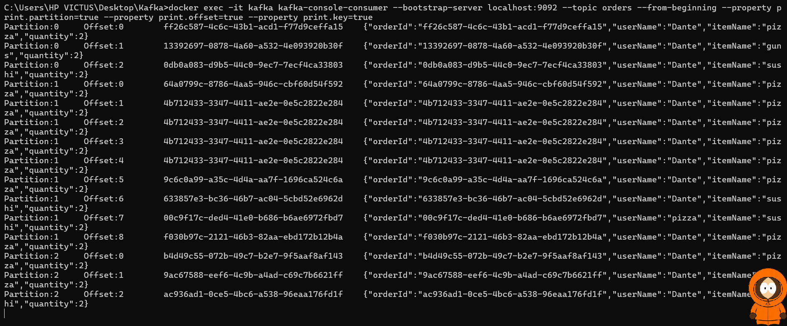
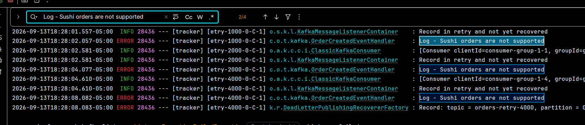
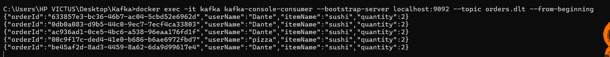

# Kafka: Producer, Tracker, particiones y reintentos

Proyecto de ejemplo con Spring Boot y Kafka. El **producer** recibe pedidos y publica eventos; el **tracker** los consume, los procesa y, si fallan, aplica reintentos antes de enviarlos a una cola de errores.

## Arquitectura



1. Un cliente envía un pedido al **producer** en el puerto `8081` mediante `POST /api/messages`.
2. El producer publica un `OrderCreatedEvent` JSON en el tópico `orders` de Kafka. Usa `orderId` como clave del mensaje.
3. El **tracker**, disponible en el puerto `8082`, consume `orders` con el grupo `group-1` y ejecuta la lógica de negocio.
4. Si el pedido se procesa correctamente, termina el flujo. Si falla, pasa por los tópicos de reintento y, después del último intento, por `orders.dlt`.

## Levantar el entorno

### Requisitos

- Docker Desktop (o Docker Engine con Docker Compose)
- Java 21

Desde la raíz del repositorio, levanta Kafka:

```powershell
docker compose up -d
docker compose ps
```

Kafka queda expuesto en `localhost:9092`. Después, levanta localmente los dos servicios Spring Boot: **tracker** queda disponible en el puerto `8082` y **producer** en el puerto `8081`.

Para detener Kafka:

```powershell
docker compose down
```

> El comando anterior conserva el volumen de Kafka. Usa `docker compose down -v` solo si también quieres eliminar los mensajes persistidos.

## Tópico `orders`: particiones, no réplicas

Para la demostración se aumentó **manualmente** el tópico `orders` a tres particiones, únicamente para observar cómo Kafka distribuye los eventos según su clave:

```powershell
docker exec -it kafka kafka-topics --bootstrap-server localhost:9092 --alter --topic orders --partitions 3
```

Esto **no** agrega réplicas de los datos. La evidencia del tópico muestra `PartitionCount: 3`, pero también `ReplicationFactor: 1`, `Replicas: 1` e `Isr: 1` en cada partición. Hay un único broker, por lo que cada partición existe una sola vez: no hay tolerancia a la caída de un broker.

```powershell
docker exec -it kafka kafka-topics --bootstrap-server localhost:9092 --describe --topic orders
```



Las particiones permiten repartir el trabajo y mantener orden dentro de cada partición. Para tener redundancia real se necesitarían varios brokers y un factor de replicación mayor a uno; eso no forma parte de esta prueba.

## Misma clave, misma partición

El producer usa `orderId` como la clave de Kafka:

```java
kafkaTemplate.send(topic, event.orderId().toString(), event)
```

Cuando se envían varios pedidos con el mismo `orderId`, todos llevan la misma clave. Kafka calcula siempre la misma partición para esa clave —mientras no cambie el número de particiones—, por lo que conserva el orden de esos eventos. En la prueba, el ID fijo `4b712433-3347-4411-ae2e-0e5c2822e284` se publicó repetidamente en la partición `1`.





Si se omite `orderId` (como se ve comentado en la siguiente petición), el producer genera un UUID diferente para cada pedido. Al cambiar la clave, Kafka puede enviar el mensaje a otra partición; en la ejecución se observaron publicaciones en las particiones `1` y `2`. No significa que deba rotar de forma estricta: la partición exacta depende del hash de cada UUID.





## Ver mensajes y resultado del procesamiento

Para leer todos los eventos guardados en el tópico principal:

```powershell
docker exec -it kafka kafka-console-consumer --bootstrap-server localhost:9092 --topic orders --from-beginning
```



Para comprobar además la partición, el offset y la clave con la que se guardó cada evento:

```powershell
docker exec -it kafka kafka-console-consumer --bootstrap-server localhost:9092 --topic orders --from-beginning --property print.partition=true --property print.offset=true --property print.key=true
```



Un pedido válido recibe `202 Accepted` del producer, el producer imprime `Message sent to the partition: …` y el tracker registra que procesó el evento. El mensaje sigue almacenado en `orders` hasta que venza la política de retención de Kafka; consumirlo no lo elimina.

## Reintentos y Dead Letter Topic

En este proyecto un pedido cuyo `itemName` es `sushi` falla a propósito. El tracker es el que detecta esa regla y lanza la excepción `Sushi orders are not supported`.

`@RetryableTopic(attempts = "4")` da un total de cuatro intentos: el intento inicial y tres reintentos. Los reintentos se publican en tópicos separados, creados por Spring Kafka para no bloquear el consumo normal de `orders`:

| Intento | Tópico observado | Espera antes del siguiente intento |
| --- | --- | --- |
| 1 | `orders` | 1 segundo |
| 2 | `orders-retry-1000` | 2 segundos |
| 3 | `orders-retry-2000` | 4 segundos |
| 4 | `orders-retry-4000` | Se envía al DLT si vuelve a fallar |

El diagrama usa nombres abreviados para representar estas tres colas; la tabla refleja los nombres observados en la ejecución, que incluyen el retraso en milisegundos.

Por eso se muestran cuatro logs de error para un pedido `sushi`: uno por cada intento de procesamiento. La captura muestra el recorrido de reintentos de 1, 2 y 4 segundos y la publicación final del evento fallido.



Al agotarse los intentos, Spring Kafka publica una copia del evento en `orders.dlt`. El tópico DLT conserva esos eventos según la política de retención de Kafka, para poder inspeccionarlos, corregir la causa y reprocesarlos de forma controlada. Se puede comprobar con:

```powershell
docker exec -it kafka kafka-console-consumer --bootstrap-server localhost:9092 --topic orders.dlt --from-beginning
```



Los tópicos de retry tampoco son una eliminación del mensaje original: son pasos adicionales del flujo. `orders` y los tópicos de retry/DLT retienen sus registros hasta que Kafka aplique su política de retención.

## ¿Por qué el DLT está en el consumer y no en el producer?

Una Dead Letter Topic representa un evento que **ya llegó correctamente a Kafka**, pero que el consumidor no pudo procesar después de agotar los reintentos. Solo el tracker sabe si la lógica de negocio terminó bien; por ejemplo, es quien rechaza `sushi`.

El producer solo publica el evento. Si su `KafkaTemplate` falla, el problema es de publicación o conectividad y el mensaje posiblemente ni siquiera llegó a Kafka; no corresponde mandarlo al DLT de consumo. Para esos casos se deben aplicar reintentos de publicación, alertas o persistencia confiable del evento pendiente.

Además, el consumer puede enviar al DLT metadatos de diagnóstico como tópico, partición, offset y excepción. Por eso `@RetryableTopic` y `@DltHandler` están en `TrackerKafkaConsumer`.

## Oportunidad de mejora: Transactional Outbox

Hoy el producer publica directamente en Kafka. Si más adelante también guarda el pedido en una base de datos, puede aparecer una inconsistencia: el pedido se guarda pero falla la publicación, o el evento se publica pero falla el guardado.

El patrón **Transactional Outbox** lo evita:

1. En una misma transacción de base de datos se guardan el pedido y un registro `outbox` con el evento pendiente.
2. Un proceso publicador lee los eventos pendientes y los envía a Kafka.
3. Tras confirmarse la publicación, marca el registro como enviado.

Así se garantiza una salida confiable de eventos. El consumer debe ser idempotente, porque el publicador puede reenviar un evento si falla justo después de publicarlo. El Outbox complementa al DLT: protege la publicación del producer; el DLT conserva fallos de procesamiento del consumer.

## Recursos

- [Playlist de recursos sobre Kafka](https://www.youtube.com/playlist?list=PLRWubtXJnfRQ)
